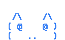

# chonk-dev

This repository contains the public organization profile for **chonk-dev**.

  

The icon and creative inspiration for this organization come from public discussion around the Claude Code source leak reported on March 31, 2026.

Main profile content lives in `.github/profile/README.md`.
